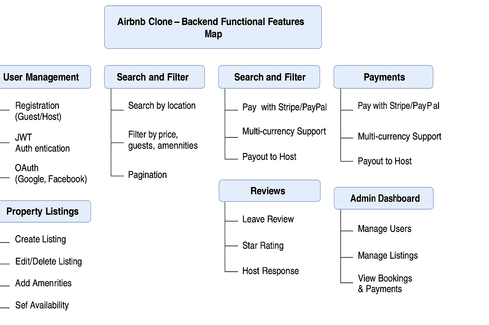

# ✨ Airbnb Clone Backend - Features and Functionalities

This document outlines all the essential features and functionalities supported by the Airbnb Clone backend system. The system is built to support users (guests and hosts), enable property listings, handle bookings and payments, and provide review and notification features. It also supports admin monitoring capabilities.

## 📷 Feature Overview Diagram

## 🗂️ Functional Areas

### 🔐 1. User Management
- Guest and Host registration
- Secure login using JWT
- OAuth authentication (Google, Facebook)
- User profile updates with image and contact info

### 🏠 2. Property Listings
- Add, edit, and delete listings
- Include price, location, description, availability
- Upload property images

### 🔎 3. Search & Filtering
- Search by location
- Filter by price, number of guests, and amenities
- Pagination for large results

### 📅 4. Booking System
- Book properties for specific dates
- Avoid double bookings
- Cancel bookings and update statuses

### 💳 5. Payments
- Integration with Stripe and PayPal
- Process guest payments
- Payouts to hosts

### 🌟 6. Reviews and Ratings
- Guests submit reviews and 1–5 ratings
- Hosts can respond to reviews
- Reviews linked to completed bookings

### 📢 7. Notifications
- Email notifications for bookings, payments, and cancellations
- Optional in-app notifications

### ⚙️ 8. Admin Dashboard
- Admin access to manage users, listings, payments
- Track system activities

---

## ✅ Deliverable

- `airbnb-backend-features.png` – Exported from Draw.io
- `README.md` – This documentation

